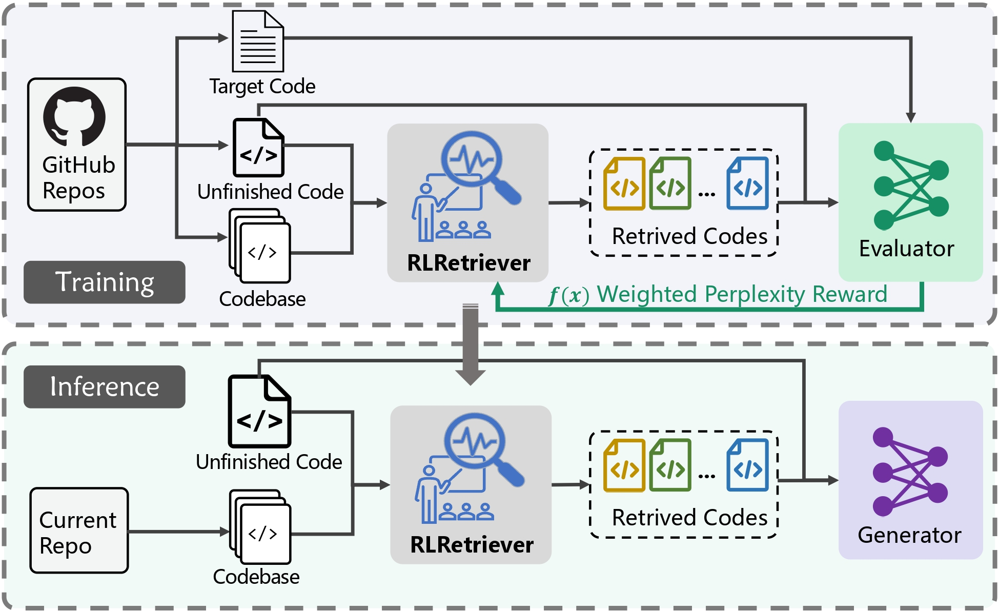
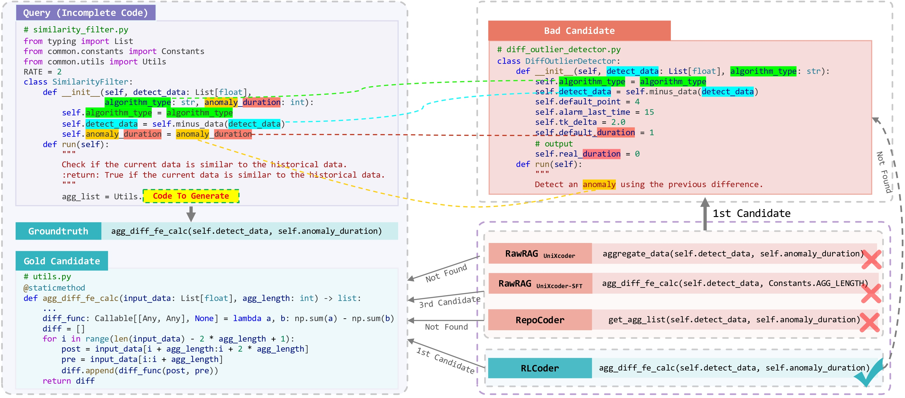

# 🖥️ RLCoder: Reinforcement Learning for Repository-Level Code Completion

📄 This repository contains the implementation for the ICSE 2025 paper, "[RLCoder: Reinforcement Learning for Repository-Level Code Completion](https://arxiv.org/abs/2407.19487)".

> In this paper, we introduce a reinforcement learning framework for repository-level code completion. 
> The core module, RLRetriever, is a retriever that can disregard seemingly useful yet ultimately useless reference code snippets, focusing instead on those more likely to contribute to accurate code generation.

**🔧 Models:** The trained `RLRetriever` is available at [RLRetriever](https://huggingface.co/nov3630/RLCoder).

**📦 Datasets:** Download the training and evaluation datasets from [Data4RLCoder](https://huggingface.co/datasets/nov3630/Data4RLCoder) to the `/data` folder.

---



---

**⚠️ If you want to reproduce the results from scratch, please follow these steps:**

**🛠️ Set-Up:** Before starting the following process, it's essential to set up your environment by installing the necessary dependencies listed in the `requirements.txt` file. To install these dependencies, activate your Python virtual environment and run:

```bash
pip install -r requirements.txt
```

## 🚀 Trianing

The training command is as follows:
```bash
# RLCoder
python main.py \
    --weighted_keywords \
    --enable_generation \
    --inference_type unixcoder_with_rl \
    --output_dir result/RLCoder \
    2>&1|tee log/RLCoder.log
```

```bash
# Ablation: natural candidates
python main.py \
    --weighted_keywords \
    --enable_generation \
    --enable_fixed_block \
    --inference_type unixcoder_with_rl \
    --output_dir result/Ablation_candidate \
    2>&1|tee log/Ablation_candidate.log
```

```bash
# Ablation: stop signal
python main.py \
    --weighted_keywords \
    --enable_generation \
    --disable_stop_block \
    --inference_type unixcoder_with_rl \
    --output_dir result/Ablation_stop_signal \
    2>&1|tee log/Ablation_stop_signal.log
```

```bash
# Ablation: unweight ppl
python main.py \
    --enable_generation \
    --inference_type unixcoder_with_rl \
    --output_dir result/Ablation_weight \
    2>&1|tee log/Ablation_weight.log
```

```bash
# RLCoder w/ RepoCoder
python main.py \
    --weighted_keywords \
    --enable_generation \
    --enable_repocoder \
    --inference_type unixcoder_with_rl \
    --rlcoder_model_path 'nov3630/RLRetriever' \ # path to trained RLCoder, eg. 'result/RLCoder/retriever_cpkt/result_0'
    --output_dir result/RepoCoder_rl \
    2>&1|tee log/RepoCoder_rl.log
```

```bash
# SFT
python main.py \
    --weighted_keywords \
    --enable_generation \
    --enable_sft \
    --inference_type unixcoder_with_rl \
    --epoch 1 \
    --inner_epoch 20 \
    --output_dir result/SFT \
    2>&1|tee log/SFT.log
```


## 🔍 Evaluation
In the evaluation section of our paper, our configuration utilizes an `in-file context` of `512` and a `cross-file context` of `1536`.

### RQ1

We evaluate the performance of `RLCoder` on 5 backbone LLMs, including `CodeLlama-7B`, `StarCoder-7B`, `StarCoder2-7B`, `DeepSeekCoder-1B` and `DeepSeekCoder-7B`.

We show an inference example on `DeepSeekCoder-7B` as follows:

```bash
# deepseekcoder-7b + RawRAG
python main.py \
    --eval \
    --weighted_keywords \
    --enable_generation \
    --inference_type unixcoder \
    --generator_model_path deepseek-ai/deepseek-coder-6.7b-base \
    --generator_max_crossfile_length 1536 \
    --generator_max_context_length 2048 \
    --generator_batch_size_per_gpu 16 \
    --output_dir result_infer/RawRAG_deepseekcoder_7b_crossfile_1536_infile_512 \
    2>&1|tee log_infer/RawRAG_deepseekcoder_7b_crossfile_1536_infile_512.log

# deepseekcoder-7b + RepoCoder
python main.py \
    --eval \
    --weighted_keywords \
    --enable_generation \
    --enable_repocoder \
    --inference_type unixcoder_with_rl \
    --generator_model_path deepseek-ai/deepseek-coder-6.7b-base \
    --rlcoder_model_path 'microsoft/unixcoder-base' \
    --generator_max_crossfile_length 1536 \
    --generator_max_context_length 2048 \
    --generator_batch_size_per_gpu 16 \
    --output_dir result_infer/RepoCoder_deepseekcoder_7b_crossfile_1536_infile_512 \
    2>&1|tee log_infer/RepoCoder_deepseekcoder_7b_crossfile_1536_infile_512.log

# deepseekcoder-7b + RLCoder
python main.py \
    --eval \
    --weighted_keywords \
    --enable_generation \
    --inference_type unixcoder_with_rl \
    --generator_model_path deepseek-ai/deepseek-coder-6.7b-base \
    --retriever_model_path 'nov3630/RLRetriever' \ # path to trained RLCoder, eg. 'result/RLCoder/retriever_cpkt/result_0'
    --generator_max_crossfile_length 1536 \
    --generator_max_context_length 2048 \
    --generator_batch_size_per_gpu 16 \
    --output_dir result_infer/RLCoder_deepseekcoder_7b_crossfile_1536_infile_512 \
    2>&1|tee log_infer/RLCoder_deepseekcoder_7b_crossfile_1536_infile_512.log
```

For other backbone LLMs, replace `deepseek-ai/deepseek-coder-6.7b-base` above to `deepseek-ai/deepseek-coder-1.3b-base`, `bigcode/starcoderbase-7b`, `bigcode/starcoder2-7b` and `codellama/CodeLlama-7b-hf`, respectively.


### RQ2

We evaluate the performance of `RLRetriever` compared with `NoRetriever`, `BM25`, `UniXcoder`, `UniXcoder-SFT`.

```bash
# NoRetriever
python main.py \
    --eval \
    --weighted_keywords \
    --enable_generation \
    --inference_type baseline \
    --generator_model_path deepseek-ai/deepseek-coder-6.7b-base \
    --generator_max_crossfile_length 1536 \
    --generator_max_context_length 2048 \
    --generator_batch_size_per_gpu 16 \
    --output_dir result_infer/Baseline_deepseekcoder_7b_crossfile_1536_infile_512 \
    2>&1|tee log_infer/Baseline_deepseekcoder_7b_crossfile_1536_infile_512.log
```

```bash
# BM25
python main.py \
    --eval \
    --weighted_keywords \
    --enable_generation \
    --inference_type BM25 \
    --generator_model_path deepseek-ai/deepseek-coder-6.7b-base \
    --generator_max_crossfile_length 1536 \
    --generator_max_context_length 2048 \
    --generator_batch_size_per_gpu 16 \
    --output_dir result_infer/BM25_deepseekcoder_7b_crossfile_1536_infile_512 \
    2>&1|tee log_infer/BM25_deepseekcoder_7b_crossfile_1536_infile_512.log
```

```bash
# UniXcoder
python main.py \
    --eval \
    --weighted_keywords \
    --enable_generation \
    --inference_type UniXcoder \
    --generator_model_path deepseek-ai/deepseek-coder-6.7b-base \
    --generator_max_crossfile_length 1536 \
    --generator_max_context_length 2048 \
    --generator_batch_size_per_gpu 16 \
    --output_dir result_infer/UniXcoder_deepseekcoder_7b_crossfile_1536_infile_512 \
    2>&1|tee log_infer/UniXcoder_deepseekcoder_7b_crossfile_1536_infile_512.log
```

```bash
# UniXcoder-SFT
python main.py \
    --eval \
    --weighted_keywords \
    --enable_generation \
    --inference_type unixcoder_with_rl \
    --generator_model_path deepseek-ai/deepseek-coder-6.7b-base \
    --retriever_model_path '' \ # path to trained UniXcoder-SFT, eg. 'result/SFT/retriever_cpkt/result_0'
    --generator_max_crossfile_length 1536 \
    --generator_max_context_length 2048 \
    --generator_batch_size_per_gpu 16 \
    --output_dir result_infer/UniXcoder_sft_deepseekcoder_7b_crossfile_1536_infile_512 \
    2>&1|tee log_infer/UniXcoder_sft_deepseekcoder_7b_crossfile_1536_infile_512.log
```

```bash
# RLRetriever
python main.py \
    --eval \
    --weighted_keywords \
    --enable_generation \
    --inference_type unixcoder_with_rl \
    --generator_model_path deepseek-ai/deepseek-coder-6.7b-base \
    --retriever_model_path 'nov3630/RLRetriever' \ # path to trained RLCoder, eg. 'result/RLCoder/retriever_cpkt/result_0'
    --generator_max_crossfile_length 1536 \
    --generator_max_context_length 2048 \
    --generator_batch_size_per_gpu 16 \
    --output_dir result_infer/RLCoder_deepseekcoder_7b_crossfile_1536_infile_512 \
    2>&1|tee log_infer/RLCoder_deepseekcoder_7b_crossfile_1536_infile_512.log
```


### RQ3

Ablation study.

```bash
# w/o RL
python main.py \
    --eval \
    --weighted_keywords \
    --enable_generation \
    --inference_type unixcoder \
    --generator_model_path deepseek-ai/deepseek-coder-6.7b-base \
    --generator_max_crossfile_length 1536 \
    --generator_max_context_length 2048 \
    --generator_batch_size_per_gpu 16 \
    --output_dir result_infer/Ablition_RL_deepseekcoder_7b_crossfile_1536_infile_512 \
    2>&1|tee log_infer/Ablition_RL_deepseekcoder_7b_crossfile_1536_infile_512.log
```

```bash
# w/o WP
python main.py \
    --eval \
    --enable_generation \
    --inference_type unixcoder_with_rl \
    --generator_model_path deepseek-ai/deepseek-coder-6.7b-base \
    --retriever_model_path '' \ # path to trained RLCoder, eg. 'result/Ablation_weight/retriever_cpkt/result_0'
    --generator_max_crossfile_length 1536 \
    --generator_max_context_length 2048 \
    --generator_batch_size_per_gpu 16 \
    --output_dir result_infer/Ablition_WP_deepseekcoder_7b_crossfile_1536_infile_512 \
    2>&1|tee log_infer/Ablition_WP_deepseekcoder_7b_crossfile_1536_infile_512.log
```

```bash
# w/o NC
python main.py \
    --eval \
    --weighted_keywords \
    --enable_generation \
    --enable_fixed_block \
    --inference_type unixcoder_with_rl \
    --generator_model_path deepseek-ai/deepseek-coder-6.7b-base \
    --retriever_model_path '' \ # path to trained RLCoder, eg. 'result/Ablation_candidate/retriever_cpkt/result_0'
    --generator_max_crossfile_length 1536 \
    --generator_max_context_length 2048 \
    --generator_batch_size_per_gpu 16 \
    --output_dir result_infer/Ablation_candidate_deepseekcoder_7b_crossfile_1536_infile_512 \
    2>&1|tee log_infer/Ablation_candidate_deepseekcoder_7b_crossfile_1536_infile_512.log
```

```bash
# w/o SS
python main.py \
    --eval \
    --weighted_keywords \
    --enable_generation \
    --disable_stop_block \
    --inference_type unixcoder_with_rl \
    --generator_model_path deepseek-ai/deepseek-coder-6.7b-base \
    --retriever_model_path '' \ # path to trained RLCoder, eg. 'result/Ablation_stop_signal/retriever_cpkt/result_0'
    --generator_max_crossfile_length 1536 \
    --generator_max_context_length 2048 \
    --generator_batch_size_per_gpu 16 \
    --output_dir result_infer/Ablation_stop_signal_deepseekcoder_7b_crossfile_1536_infile_512 \
    2>&1|tee log_infer/Ablation_stop_signal_deepseekcoder_7b_crossfile_1536_infile_512.log


# w/o SS on GitHubEval
Just replace the backbone LLMs above.

```


### RQ4

RepoCoder + RLCoder.

```bash
# RepoCoder + RLCoder
python main.py \
    --eval \
    --weighted_keywords \
    --enable_generation \
    --enable_repocoder \
    --inference_type unixcoder_with_rl \
    --generator_model_path deepseek-ai/deepseek-coder-6.7b-base \
    --retriever_model_path '' \ # path to trained RepoCoder_rl, eg. 'result/RepoCoder_rl/retriever_cpkt/result_0'
    --rlcoder_model_path 'nov3630/RLRetriever' \
    --generator_max_crossfile_length 1536 \
    --generator_max_context_length 2048 \
    --generator_batch_size_per_gpu 16 \
    --output_dir result_infer/RepoCoder_RLCoder_deepseekcoder_7b_crossfile_1536_infile_512 \
    2>&1|tee log_infer/RepoCoder_RLCoder_deepseekcoder_7b_crossfile_1536_infile_512.log
```

## Case Study


## Citation
 
**BibTeX:**
```
@misc{wang2024rlcoderreinforcementlearningrepositorylevel,
      title={RLCoder: Reinforcement Learning for Repository-Level Code Completion}, 
      author={Yanlin Wang and Yanli Wang and Daya Guo and Jiachi Chen and Ruikai Zhang and Yuchi Ma and Zibin Zheng},
      year={2024},
      eprint={2407.19487},
      archivePrefix={arXiv},
      primaryClass={cs.SE},
      url={https://arxiv.org/abs/2407.19487}, 
}
```
